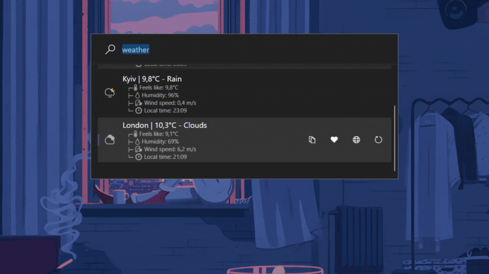
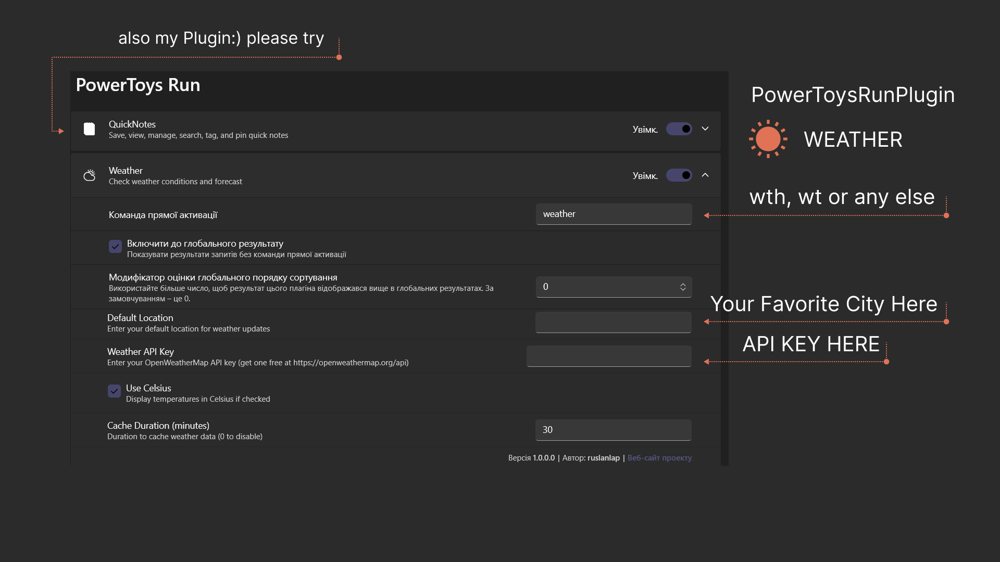
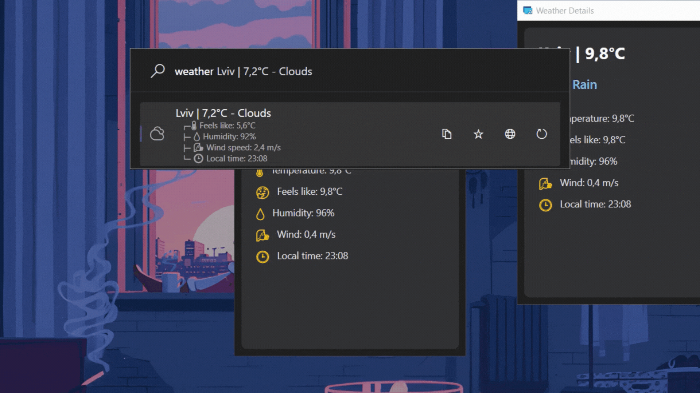
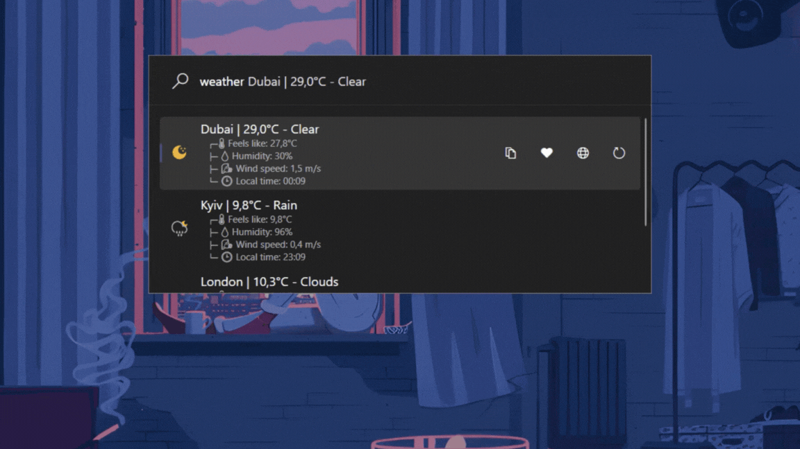

# 🌦️ PowerToys Run: Weather Plugin

<div align="center">
  
  
  <p align="center">
    
  </p>
  
  <h1>✨ Weather for PowerToys Run ✨</h1>
  <h3>Get real-time weather information directly from PowerToys Run</h3>
  
  
  
  [](https://opensource.org/licenses/MIT)
  
  
  
  
  [](https://github.com/ruslanlap/PowerToysRun-Weather/stargazers)
  [](https://github.com/ruslanlap/PowerToysRun-Weather/issues)
  [](https://github.com/ruslanlap/PowerToysRun-Weather/releases/latest)
  [](https://github.com/ruslanlap/PowerToysRun-Weather/releases)
  
  
</div>

<div align="center">
  <a href="https://github.com/ruslanlap/PowerToysRun-Weather/releases/download/v1.0.0/Weather-x64.zip">
    
  </a>
  <a href="https://github.com/ruslanlap/PowerToysRun-Weather/releases/download/v1.0.0/Weather-ARM64.zip">
    
  </a>
</div>

## 📋 Table of Contents

- [📋 Overview](#-overview)
- [⚡ Easy Install](#-easy-install)
- [✨ Features](#-features)
- [🎬 Demo Gallery](#-demo-gallery)
- [🚀 Installation](#-installation)
- [🔧 Usage](#-usage)
- [📁 Data Storage](#-data-storage)
- [🛠️ Building from Source](#️-building-from-source)
- [📊 Project Structure](#-project-structure)
- [🤝 Contributing](#-contributing)
- [❓ FAQ](#-faq)
- [✨ Why You'll Love Weather Plugin](#-why-youll-love-weather-plugin)
- [📄 License](#-license)
- [🙏 Acknowledgements](#-acknowledgements)
- [🛠️ Implementation Details](#-implementation-details)

## 📋 Overview

Weather is a plugin for [Microsoft PowerToys Run](https://github.com/microsoft/PowerToys) that allows you to quickly check weather conditions directly from your PowerToys Run interface. Simply type `weather` followed by a location to get real-time weather information, or set up favorite locations for instant access.

<div align="center">
  
</div>

## ⚡ Easy Install

<div align="">
  <a href="https://github.com/ruslanlap/PowerToysRun-Weather/releases/download/v1.0.0/Weather-x64.zip">
    
  </a>
  
  <p>
    <b>Quick Installation Steps:</b><br>
    1. Download using the button above<br>
    2. Extract to <code>%LOCALAPPDATA%\Microsoft\PowerToys\PowerToys Run\Plugins\</code><br>
    3. Restart PowerToys<br>
    4. Start using with <code>Alt+Space</code> then type <code>weather</code>
  </p>
</div>

## ✨ Features

- 🌍 **Location-based Weather** - Get weather for any city worldwide
- 🏠 **Default Location** - Set your home location for quick access
- ⭐ **Favorite Locations** - Save multiple locations for easy checking
- 🧠 **Smart Geolocation** - Automatically detect your current location
- 🌡️ **Temperature Units** - Choose between Celsius and Fahrenheit
- 🔍 **Detailed Information** - View comprehensive weather data including:
  - Current temperature
  - "Feels like" temperature
  - Humidity percentage
  - Wind speed and direction
  - Weather condition with icon
- 🖼️ **Visual Weather Window** - See detailed weather in a dedicated window
- 🔄 **Auto-refresh** - Weather data is cached but refreshed regularly
- 🔑 **API Key Management** - Easy setup with OpenWeatherMap API
- 🌓 **Theme Support** - Works with both light and dark PowerToys themes
- 🕒 **Location Time** - Displays the current time at the weather location
- 🎨 **Beautiful Widget** - Elegant popup window with modern UI design that works like a mini weather widget

## 🎬 Demo Gallery

<div align="center">
  <h3>🌍 Search Weather by City</h3>
  <p></p>
  <p><i>Simply type <code>weather</code> followed by a city name</i></p>
  
  <h3>🏠 Default Location Weather</h3>
  <p></p>
  <p><i>Just type <code>weather</code> to see your default location's weather</i></p>

  <h3>⭐ Favorite Locations</h3>
  <p></p>
  <p><i>Quickly access weather for your saved favorite locations</i></p>

  <h3>🖼️ Weather Details Window</h3>
  <p></p>
  <p><i>View detailed weather information in a dedicated window</i></p>
</div>

## 🚀 Installation

### 📋 Prerequisites

- [Microsoft PowerToys](https://github.com/microsoft/PowerToys/releases) installed
- Windows 10 or later
- [OpenWeatherMap API key](https://openweathermap.org/api) (free tier is sufficient)

### 📥 Installation Steps

1. Download the latest release from the [Releases page](https://github.com/ruslanlap/PowerToysRun-Weather/releases/latest)
2. Extract the ZIP file to:
   ```
   %LOCALAPPDATA%\Microsoft\PowerToys\PowerToys Run\Plugins\
   ```
3. Restart PowerToys
4. Open PowerToys Run and type `weather` to access the plugin
5. Enter your OpenWeatherMap API key in the plugin settings

<div align="center">
  <a href="https://github.com/ruslanlap/PowerToysRun-Weather/releases/latest">
    
  </a>
</div>

## 🔧 Usage

1. Open PowerToys Run (default: <kbd>Alt</kbd> + <kbd>Space</kbd>)
2. Use the following commands:

<div align="center">

| Command | Description | Example |
|---------|-------------|---------|
| `weather` | Show weather for default or current location | `weather` |
| `weather <city>` | Show weather for a specific city | `weather London` |
| `weather <city>, <country>` | Show weather for a specific city with country code | `weather London, UK` |

</div>

### 🎯 Quick Tips

- Press <kbd>Enter</kbd> on a weather result to open the detailed weather window
- Right-click on a weather result for additional options
- Set your favorite locations in the plugin settings for quick access
- The plugin caches weather data to minimize API calls
- Weather data is automatically refreshed when needed

## 📁 Data Storage

The Weather plugin stores the following data locally:

- Your OpenWeatherMap API key
- Default location
- Favorite locations
- Temperature unit preference (Celsius/Fahrenheit)
- Cached weather data (temporary)

All settings are stored securely in the PowerToys settings file.

## 🛠️ Building from Source

1. Clone the repository:
   ```
   git clone https://github.com/ruslanlap/PowerToysRun-Weather.git
   ```

2. Open the solution in Visual Studio 2022 or later

3. Build the solution:
   ```
   dotnet build Weather/Weather.sln
   ```

4. Run the build-and-zip script to create installation packages:
   ```
   ./build-and-zip.sh
   ```

## 📊 Project Structure

```
Weather/
├── Community.PowerToys.Run.Plugin.Weather/
│   ├── Images/                  # Plugin icons
│   ├── Main.cs                  # Main plugin logic
│   ├── WeatherResultWindow.xaml # Weather details window
│   ├── plugin.json             # Plugin metadata
│   └── ...
├── Community.PowerToys.Run.Plugin.Weather.UnitTests/
│   └── ...                      # Unit tests
└── Weather.sln                  # Solution file
```

## 🤝 Contributing

Contributions are welcome! Here's how you can help:

1. Fork the repository
2. Create a feature branch: `git checkout -b feature/amazing-feature`
3. Commit your changes: `git commit -m 'Add amazing feature'`
4. Push to the branch: `git push origin feature/amazing-feature`
5. Open a Pull Request

Please make sure to update tests as appropriate.

### Contributors

- [ruslanlap](https://github.com/ruslanlap) - Project creator and maintainer
- [hlaueriksson](https://github.com/hlaueriksson) - Contributor and inspiration

## ❓ FAQ

<details>
<summary><b>How do I get an OpenWeatherMap API key?</b></summary>
<p>Visit <a href="https://openweathermap.org/api">OpenWeatherMap</a>, create a free account, and generate an API key. The free tier allows up to 1,000 API calls per day, which is more than enough for personal use.</p>
</details>

<details>
<summary><b>Why does the plugin need my location?</b></summary>
<p>The plugin uses your location only to provide weather information for your current area when no specific location is requested. This is optional - you can set a default location instead.</p>
</details>

<details>
<summary><b>How often is the weather data updated?</b></summary>
<p>Weather data is cached for 30 minutes to reduce API calls. After that time, new data will be fetched automatically.</p>
</details>

<details>
<summary><b>Can I use this plugin offline?</b></summary>
<p>The plugin requires internet access to fetch weather data. However, it will display cached data if available when offline.</p>
</details>

<details>
<summary><b>How can I change from Celsius to Fahrenheit?</b></summary>
<p>Open the plugin settings by typing "weather settings" in PowerToys Run, then toggle the temperature unit option.</p>
</details>

## ✨ Why You'll Love Weather Plugin

- **Saves Time**: Check the weather without opening a browser or app
- **Keyboard-Centric**: Perfect for keyboard power users
- **Customizable**: Set your preferred locations and units
- **Fast**: Instant access to weather information
- **Beautiful**: Clean, modern UI that matches PowerToys style
- **Privacy-Focused**: No tracking, only uses location when needed
- **Resource-Efficient**: Lightweight with minimal system impact

## 📄 License

This project is licensed under the MIT License - see the [LICENSE](LICENSE) file for details.

## 🙏 Acknowledgements

- [Microsoft PowerToys](https://github.com/microsoft/PowerToys) team for the amazing launcher
- [OpenWeatherMap](https://openweathermap.org/) for providing the weather API
- All contributors who have helped improve this plugin

## 🛠️ Implementation Details

The Weather plugin is built using:

- C# and .NET
- WPF for the UI components
- HttpClient for API communication
- System.Text.Json for JSON parsing
- Task-based asynchronous pattern for non-blocking operations

The plugin implements several PowerToys Run interfaces:
- `IPlugin` - Core plugin functionality
- `IContextMenu` - Right-click context menu
- `IDisposable` - Resource cleanup
- `IPluginI18n` - Internationalization support
- `ISettingProvider` - Settings management

### Roadmap

- [ ] Multiple day forecast
- [ ] Weather alerts and notifications
- [ ] More unit options (wind speed, pressure)
- [ ] Custom themes for weather window
- [ ] Additional weather providers
- [ ] Offline mode improvements
- [ ] Location autocomplete
- [ ] Weather maps integration
